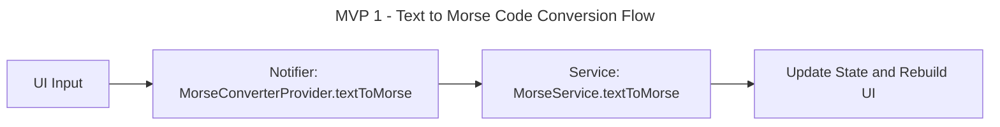

# What I have done
- Built the basic MVP 1
- Contains just the text to morse code conversion
- UI layer gets and input from the user and shows the converted text

```mermaid
---
title: MVP 1 - Text to Morse Code Conversion Flow
---
flowchart LR
    A[UI Input]
    B[Notifier: MorseConverterProvider.textToMorse]
    C[Service: MorseService.textToMorse]
    D[Update State and Rebuild UI]

    A --> B --> C --> D
```